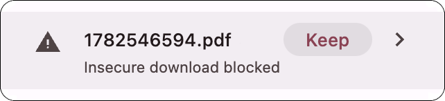

# Zouk scan retriever

[](Package.swift)
[](https://github.com/woodie/zouk/actions/workflows/CI.yml)
[](https://github.com/woodie/zouk/releases/latest)
[](LICENSE)




We now have [tools](https://github.com/woodie/lambada/) to get files from
an old scanner (that requires and open relay) but downloading files over HTTP
with a web browser can be a drag (with steps to keep unsafe documents off your
computer) and setting up HTTPS on your internal network is an absolute pain.
Finally, serving files with Samba can work but it can be slow and awkward to use.


Fear not, now we have the Zouk scan retriever for MacOS.
This minimal Swift app is just what we need for browsing and downloading scans
through [lambada](https://github.com/woodie/lambada) (created with Go)
or [scandalous](https://github.com/woodie/scandalous) (created with Ruby).
The main screen is similar ro a Samba share but much fater and easier to use.

On launch, zouk asks for a hostname or IP address (e.g.
`10.0.1.111`) and remembers it for next time.
If the server can't be reached, it shows an inline error and lets you
retry or change the server. Once connected, click a thumbnail to see its
date and size in the footer, and double-click to save it -- a native
Save panel opens with the scan's name and `~/Downloads` already
selected, so confirming as-is saves it there just like before, but
renaming it or picking a different folder is just as easy. Either way,
once it's saved it opens in whatever app handles PDFs, the same as
double-clicking a file on a mounted network share. While it saves
you'll see a brief "Saving…" note, and once it's done the footer reads
"File … saved." and stays that way until you click something else, so
it's hard to miss.

Run `make run` rather than `swift run` directly -- it assembles a minimal
`zouk.app` and launches it with `open`, so macOS activates it like a
normal Mac app instead of leaving keystrokes going to the terminal.

## Compatibility

zouk talks `GET /files.json` and expects a `path` field per entry.
Requires a matching server:
[scandalous](https://github.com/woodie/scandalous) 0.3.0+ or
[lambada](https://github.com/woodie/lambada)'s lambada-web 2.0.0+.

## Development

Building from source and the project layout moved to
[docs/DEVELOPER.md](docs/DEVELOPER.md).

## Install

**Homebrew** (recommended -- handles updates too):

```
brew tap woodie/zouk
brew install --cask zouk
```

**Direct download**: grab the latest `.pkg` from the
[Releases page](https://github.com/woodie/zouk/releases/latest) and
double-click it -- Next, Next, Done, like any other Mac installer.

Either way, zouk is signed and notarized (see
[docs/DELIVERY.md](docs/DELIVERY.md)), so it installs and launches with
no Gatekeeper warning -- just the routine "downloaded from the Internet"
notice macOS shows on any first launch, with a normal Open button.
