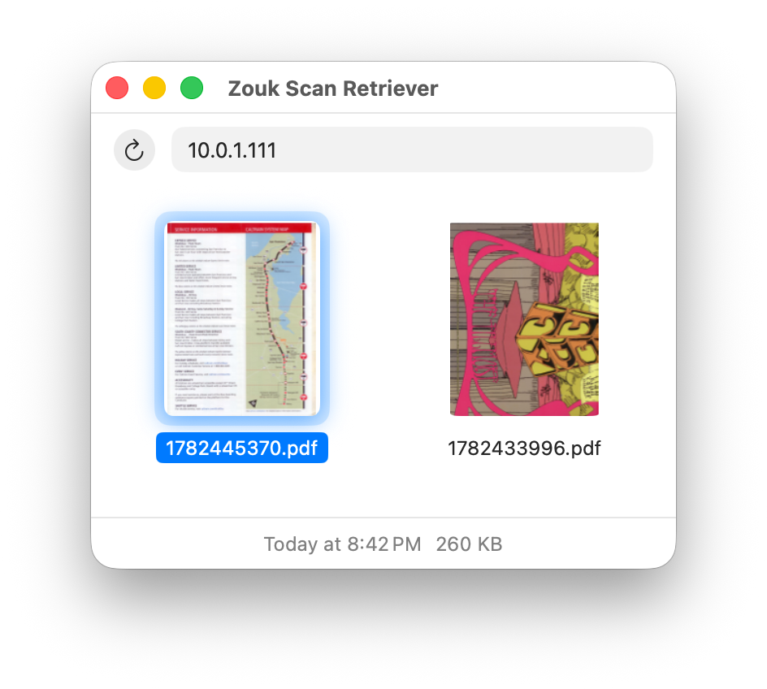

# Zouk scan retriever

[](Package.swift)
[](https://github.com/woodie/zouk/actions/workflows/CI.yml)
[](https://github.com/woodie/zouk/releases/latest)
[](LICENSE)



This project was created because we now have tools to get files from an old
scanner that requires and open relay but downloading files over HTTP can be
a drag (with steps to keep unsafe documents off your computer) and setting
up HTTPS on your internal network is an absolute pain. Finally, serving files
with Samba works but it can be slow and awkward to use.

Fear not, now we have the Zouk scan retriever. A minimal macOS client for
browsing and downloading the scans your old scanner/printer relays through
[lambada](https://github.com/woodie/lambada/) or
[scandalous](https://github.com/woodie/scandalous).
The main screen is similar ro a Samba share but much fater and easier to use.

## Backend server

Currently, `lambada` doesn't have an HTTP server, so zouk uses the
`scandalous` server json endpoint. Once the client works end-to-end, the plan
is to build a simple Go service in `lambada` to have a smaller footprint.

## Using it

On launch, zouk asks for a hostname or IP address (e.g.
`scans.example.com` or `10.0.1.111:8080`) and remembers it for next time.
If the server can't be reached, it shows an inline error and lets you
retry or change the server. Once connected, click a thumbnail to see its
date and size in the footer, and double-click to download it to
`~/Downloads` (repeat downloads get Finder-style " (1)", " (2)" suffixes
instead of overwriting). The address bar at the top is editable directly
(type a new host and press Enter to reconnect); the reload icon
re-fetches the list.

Run `make run` rather than `swift run` directly -- it assembles a minimal
`zouk.app` and launches it with `open`, so macOS activates it like a
normal Mac app instead of leaving keystrokes going to the terminal.

## Building

Requires Xcode/Swift on macOS (this is a Mac-only app; no Linux/iOS
target).

```
swift build      # or: make build
swift run        # or: make run
swift test       # or: make test
```

`make xcode` opens `Package.swift` directly in Xcode.

## Layout

- `Sources/ZoukKit` -- model, networking, and views (a library target so
  `Tests/ZoukKitTests` can `@testable import` it).
- `Sources/zouk` -- the thin `@main` app entry point.
- `Tests/ZoukKitTests` -- unit tests for hostname parsing, JSON decoding,
  and the URL-resolution logic the download path relies on.
- `docs/DELIVERY.md` -- how to cut and hand off a build.
- `docs/COWORK.md` -- context for picking this project back up cold.
- `.github/workflows/CI.yml` -- runs `make build`/`make test` on macOS for
  every push/PR to `main`.
